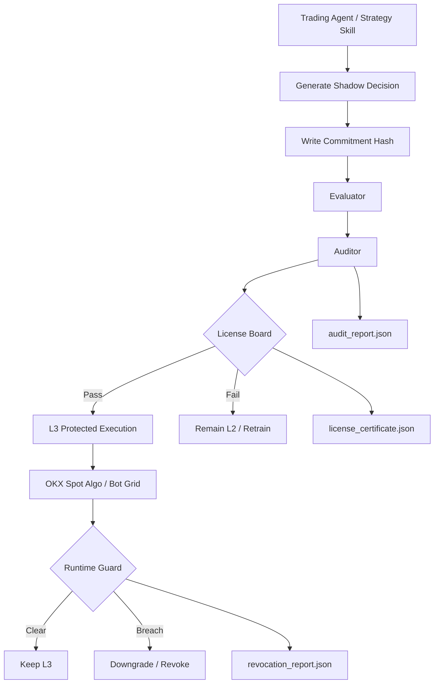

# ProofTrade v2

> **AI 交易 Agent 不应默认获得执行权。它必须先证明自己，才能被允许交易。**

**ProofTrade** 是一套面向 **OKX CEX Trading Agents** 的 **信任、审计、发证与熔断系统**。  
它不是另一个“聊天下单助手”，而是一套让 Agent：

- 先在 `Shadow` 模式里证明自己
- 再接受审计与发证
- 再获得 **OKX 受保护执行权**
- 并在运行中持续接受熔断检查

一句话概括：

**执行权限不是默认拥有的，而是 earned, not assumed。**

---

## TL;DR

ProofTrade 把交易 Agent 的执行资格拆成 6 个环节：

1. `Strategy Skill` 读取 OKX 上下文并生成 `shadow decision`
2. `Commitment` 固定当时的承诺
3. `Evaluator` 量化评估行为与结果
4. `Auditor` 批量审阅一个窗口内的 shadow 记录
5. `License Board` 决定是否从 `L2` 升到 `L3`
6. `Runtime Guard` 在运行中随时降级或吊销

即便达到 `L3`，Agent 也不能裸下单，只能走：

- `okx spot algo place`
- `okx bot grid create`

---

## 我们解决什么问题

大多数交易 Agent 的真正问题不是“不会分析”，而是“用户不敢给它执行权”。

用户真正关心的是：

- 它会不会马后炮
- 它会不会越权
- 它会不会在高风险环境里乱下单
- 它凭什么替我动账户

ProofTrade 的回答是：

**先承诺，先 shadow，先评估，先审计，再发证；发出去的证还可以撤销。**

---

## 目标用户

ProofTrade 当前更适合：

- AI 交易策略开发者
- 使用 OKX Agent Trade Kit 构建交易 Agent 的团队
- 想给 Agent 加一层风控、审计和权限系统的 Builder

它当前**不是**面向普通散户的终端 App。  
它更像一个：

**AI Trading Agent 的风控中间件 / License Layer**

---

## 为什么适合第二届 OKX AI Hackathon

第二届比赛是 **CEX 主导**。

所以我们刻意没有做一个普通的“AI 帮你下单”，而是做了一套：

**先 shadow、再评估、再审计、再授权、最后才允许 CEX 受保护执行的交易 Agent 许可系统。**

这与第二届主线的贴合点在于：

- 围绕 OKX CEX 上下文构建
- 强调 `spot algo` / `bot grid` 这类高阶执行能力
- 把风控与执行权绑定
- 不让 Agent 直接获得 unrestricted trade 权限

---

## 当前产品形态

### 已实现的核心

当前代码已经实现：

- `commitment`
- `shadow evaluation`
- `auditor report`
- `license board`
- `runtime guard`
- `protected execution`
- `OKX demo submit`
- `X Layer publication`

### 已实现的 Strategy Skill Slot v1

ProofTrade 当前已经实现 **白名单 Strategy Skill 插槽层**。

也就是说：

- 不同策略 skill 可以接入 ProofTrade
- 每个策略版本单独审计、单独发证
- 策略可以换，但 trust layer 不变

当前规则已经落地：

- 只允许仓库内白名单 `strategy skills`
- strategy skill 支持 **prompt/skill 型决策**
- strategy skill 可以通过用户自己的 OpenClaw / 自定义命令消费 ProofTrade 提供的 OKX 上下文
- strategy skill 只负责生成结构化 `shadow decision`
- strategy skill 不能直接执行
- License 必须绑定：
  - `agent_id`
  - `strategy_id`
  - `strategy_version_hash`
- 同一时间只允许一个 `active strategy`

这意味着：

- 用户以后可以切换策略
- 但每次换策略或改 prompt，都必须重新拿证
- 旧策略的执照不能直接继承给新策略
- 当前同时支持：
  - `LLM-backed strategy skill`
  - `deterministic fallback strategy`

当前默认 deterministic strategy 也已经显式消费：

- `bid / ask` 与 spread
- `24h change`
- `total equity`
- `unrealized pnl`
- `current positions`

---

## 核心架构



---

## Trust Flow

### 1. Shadow Commitment

回答：
**它是不是在结果出现前就表态了？**

核心对象：

- `canonical payload`
- `commitment hash`
- `commitment record`

### 2. Performance Attestation

回答：
**它是不是长期守纪律、风险可控？**

核心指标：

- `policyComplianceBps`
- `maxAdverseExcursionBps`
- `syntheticPnlBps`
- `riskAdjustedScore`

### 3. Promotion Audit

回答：
**它是不是配得上从 L2 升到 L3？**

当前实现里支持两种审计引擎：

- `LLM-backed Auditor Agent`
- `deterministic fallback auditor`

它们都输出同一份：

- `audit_report.json`

默认设计原则是：

- 优先尝试用户接入的 `Auditor Agent`
- 若外部 LLM 未配置或执行失败，回退到确定性审计逻辑

这样既保留了真实的 Agent 审计能力，也保证了工程稳定性。

### 4. Protected Execution + Runtime Guard

回答：
**即便已经拿到执照，它现在还配继续执行吗？**

这层分成两部分：

- `L3 Protected Execution`
  - 只允许 `spot algo`
  - 或 `bot grid`
- `Runtime Guard`
  - 运行中动态检查风控
  - 一旦触发阈值，降级或吊销

---

## OKX Integration Matrix

> 这里只写 **当前真实已实现或已映射** 的部分，不把未完成能力包装成已上线。

| ProofTrade 模块 | OKX 能力 / 命令面 | 当前状态 | 作用 |
| :--- | :--- | :--- | :--- |
| Strategy Context | `market` / `portfolio` 结构化上下文 | OpenClaw / strategy 主流程已同步 live ticker、balance、positions、bid/ask、24h high/low/vol、total equity、unrealized pnl | 为 shadow 决策与评估提供 CEX 快照 |
| Protected Execution | `okx spot algo place` | 已完成真实 request / CLI 映射 | `L3` 主执行路径 |
| Protected Bot | `okx bot grid create` | 已完成真实 request / CLI 映射 | `L3` 次执行路径 |
| Demo Submit | `~/.okx/config.toml` + demo profile | 已完成 profile 检查与 submission 回写 | 真实 demo 提交链路 |
| X Layer 发布 | state -> registry publish | 已完成 bundle、部署脚本、发布脚本 | 对外公开 validation / audit / license 状态 |

说明：

- **执行侧是真实 OKX CLI 命令面**
- **OpenClaw / strategy 主流程已经同步更厚的 live market/account 上下文**
- **真实 `algo submit` 已在提交前使用 live market price 重算触发价**
- **默认 deterministic strategy 也会真实消费 richer context 做 spread / volatility / equity / UPL gating**
- 当前还不能把项目描述成“全品类、全字段实时交易 agent 已完成”，但主提交流程已是真实上下文驱动

---

## 风控拦截场景

### 场景 1：L2 越权执行

如果 Agent 仍处于 `L2`，却请求直接进入执行态：

```json
{
  "agent_intent": "protected_execute",
  "current_level": "L2",
  "action": "BLOCKED",
  "reason": "Execution requires L3 license"
}
```

### 场景 2：运行中触发最大回撤

如果 Agent 已在 `L3`，但运行中触发 drawdown 阈值：

```json
{
  "current_level": "L3",
  "runtime_guard_action": "DOWNGRADE_TO_L2",
  "reason": "MAX_DRAWDOWN_BREACH",
  "result": "execution revoked"
}
```

### 场景 3：非受保护模式请求

如果 Agent 试图绕过 `spot algo / bot grid`：

```json
{
  "requested_mode": "raw_trade",
  "allowed_modes": [
    "algo",
    "bot"
  ],
  "action": "REJECTED",
  "reason": "UNPROTECTED_EXECUTION_NOT_ALLOWED"
}
```

---

## 接入用户自己的 OpenClaw / 自定义 LLM 命令

ProofTrade 现在已经支持把 **用户自己的 OpenClaw 包装器** 或 **任意自定义命令** 接到两个位置：

- `Strategy Skill`
- `Auditor Agent`

支持方式有两种。

### 方式 1：环境变量

```powershell
$env:PROOFTRADE_STRATEGY_COMMAND = "your-openclaw-wrapper"
$env:PROOFTRADE_STRATEGY_ARGS_JSON = "[\"strategy\",\"--json\"]"

$env:PROOFTRADE_AUDITOR_COMMAND = "your-openclaw-wrapper"
$env:PROOFTRADE_AUDITOR_ARGS_JSON = "[\"auditor\",\"--json\"]"
```

### 方式 2：CLI 直接传参

```powershell
npm run openclaw -- full-demo examples/sample-evaluation-input.json --strategy momentum-spot-algo --mode algo --bootstrap-l3 --llm-strategy-command your-openclaw-wrapper --llm-strategy-args-json "[\"strategy\",\"--json\"]"
```

```powershell
npm run audit -- examples/sample-evaluation-input.json --bootstrap-l3 --auditor auditor-agent-001 --llm-auditor-command your-openclaw-wrapper --llm-auditor-args-json "[\"auditor\",\"--json\"]"
```

### 命令协议

ProofTrade 会通过 `stdin` 发送 JSON：

```json
{
  "task": "strategy",
  "system_prompt": "...",
  "input": {}
}
```

或：

```json
{
  "task": "auditor",
  "system_prompt": "...",
  "input": {}
}
```

外部命令只需要在 `stdout` 返回结构化 JSON。

这意味着：

- 你可以直接接自己的 OpenClaw skill runner
- 也可以接任意本地脚本或 Agent 包装器
- ProofTrade 不绑定某个模型，只绑定结构化输出和后续 trust flow

---

## 当前最真实的工程边界

为了让 Gemini 评分建立在真实基础上，这里直接写清楚：

### 1. 策略与审计已经支持 LLM，但当前仍是 fallback-first 架构

当前仓库里的强项是：

**trust / audit / license / revoke**

而不是构建一个大型多模型交易研究平台。

当前已经支持：

- `LLM-backed strategy skill`
- `LLM-backed auditor agent`
- 确定性 fallback

但当前示例仍然以收敛的白名单 strategy skills 为主，不追求任意 prompt 无限扩展。

### 2. OKX 实时上下文已经变厚，但还不是“全量账户镜像”

当前已经完成：

- 执行 request 生成
- CLI submit
- profile 安全检查
- `algo submit` 前读取 live market ticker 并重算触发价
- OpenClaw / strategy 主流程读取：
  - live ticker
  - bid / ask
  - 24h high / low / vol
  - available balance
  - total equity
  - positions
  - unrealized pnl

但：

- 还没有接完所有 OKX 市场与账户字段
- 也没有做持续在线的全账户状态流

### 3. Runtime Guard 已支持 live ticker，但当前仍是“按调用执行”的守卫

当前已经支持：

- 手动 `currentPrice`
- 或基于 OKX `profile / runner` 自动读取 live ticker

但它当前仍然是：

- 每次 workflow 调用时执行一次

而不是：

- 一个长期驻留的后台监控 daemon

这些不影响产品方向成立，但它们是当前最真实的工程边界。

---

## 当前已实现的程序链路

当前主链路已经跑通：

1. Strategy Skill 生成 `shadow decision`
2. 写入 commitment
3. evaluator 计算 attestation
4. auditor 输出审计结论
5. License Board 决定是否晋升
6. 若达到 `L3`，只允许受保护执行
7. Runtime Guard 在运行中可降级或吊销
8. 状态可发布到 X Layer

已验证命令包括：

- `npm test`
- `npm run build`
- `npm run replay -- examples/sample-evaluation-input.json --scenario extreme-volatility-replay`
- `npm run audit -- examples/sample-evaluation-input.json --bootstrap-l3 --auditor auditor-agent-001`
- `npm run openclaw -- full-demo examples/sample-evaluation-input.json --strategy momentum-spot-algo --mode algo --bootstrap-l3`
- `npm run openclaw -- guard examples/sample-evaluation-input.json --bootstrap-l3 --profile demo`

---

## 运行方式说明

所有 `npm run ...` 命令默认都需要在仓库根目录执行。

如果当前目录不是仓库根目录，请改用通用形式：

```powershell
npm --prefix <repo-root> run <script> -- <args>
```

例如在仓库根目录触发真实 OpenClaw demo submit：

```powershell
npm run openclaw -- submit examples/sample-evaluation-input.json --strategy momentum-spot-algo --mode algo --bootstrap-l3 --profile demo --data-dir .\tmp-user-test
```

---

## 证据快照

### Evidence 1：L2 被拦截

```json
{
  "agent_id": "prooftrade-agent-001",
  "current_level": "L2",
  "requested_action": "protected_execution",
  "decision": "blocked",
  "reason": "Execution requires L3 license"
}
```

### Evidence 2：L3 执照

```json
{
  "agent_id": "prooftrade-agent-001",
  "strategy_id": "momentum-spot-algo",
  "current_level": "L3",
  "allowed_execution_modes": [
    "algo",
    "bot"
  ],
  "policy_compliance_bps": 10000,
  "status": "active"
}
```

### Evidence 3：Runtime Guard 降级

```json
{
  "agent_id": "prooftrade-agent-001",
  "previous_level": "L3",
  "new_level": "L2",
  "reason": "MAX_DRAWDOWN_BREACH",
  "action": "downgrade"
}
```

---

## 安全声明

- **本项目仅在 OKX 模拟盘 / Demo Trading 环境下测试**
- **API Key 仅在本地保存，不向 Agent 透露敏感信息**
- **本项目仅调用 OKX 官方 Agent Trade Kit / CLI 能力**
- **本项目不使用真实资金进行演示**

---

## 四维评分映射

### 1. Integration

- 围绕 OKX CEX 主线构建
- 显式接入 `spot algo` / `bot grid`
- Strategy Skill 可以读 OKX 上下文
- X Layer 负责公开发布 license / audit / validation

### 2. Practicality

- 解决“用户不敢给 AI 执行权”的真实问题
- 有准入，也有熔断
- `license_certificate.json` / `audit_report.json` / `revocation_report.json` 可直接用于展示与审查

### 3. Innovation

- `earned, not assumed`
- `L2 -> L3` 不是直接升级，而是 shadow + audit + board 的组合许可
- `L3` 不是永久资格，而是可撤销资格
- 执照绑定 `strategy_version_hash`

### 4. Reproducibility

- 有结构化日志
- 有回放脚本
- 有静态 JSON 证据
- 有 CLI 全流程入口

---

## 推荐演示路径

如果要让 Gemini 或人类评委在 2 分钟内看懂，最强路径是：

1. 展示 Agent 当前是 `L2`
2. 展示一次 `L2` 越权执行被拒
3. 跑一轮 `shadow replay`
4. 生成 `audit_report.json`
5. 生成 `license_certificate.json`
6. 展示 `L3` 下的 `spot algo` 放行
7. 再展示运行中触发风控，被 Runtime Guard 降回 `L2` 或吊销

这条路径能证明：

- 系统真的会拒绝
- 系统真的会升级
- 系统真的会执行
- 系统真的会撤销权限
